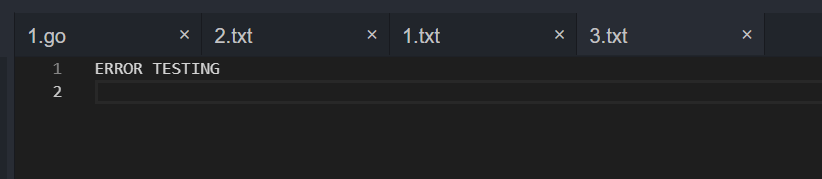

# 测试截图

输入文件

```
1
2
3
4
5
6
7
8
9
0
1
2
3
4
5
6
7
8
9
0
(省略300行)
```


```
$ selpg -s1 -e1 input_file
```


```
$ selpg -s1 -e1 < input_file
```


```
$ other_command | selpg -s10 -e20
```


```
$ selpg -s10 -e20 input_file >output_file
```


````
$ selpg -s10 -e20 input_file 2>error_file
````




```
$ selpg -s10 -e20 input_file >output_file 2>error_file
```


```
$ selpg -s10 -e20 input_file >output_file 2>/dev/null
```


````
$ selpg -s10 -e20 input_file >/dev/null
````


```
$ selpg -s10 -e20 input_file | other_command
```


```
$ selpg -s10 -e20 input_file 2>error_file | other_command
```


```
$ selpg -s10 -e20 -l66 input_file
```


```
$ selpg -s10 -e20 -f input_file
```


使用\n临时替代\f


```
$ selpg -s10 -e20 -dlp1 input_file
```


```
$ selpg -s10 -e20 input_file > output_file 2>error_file &
```


