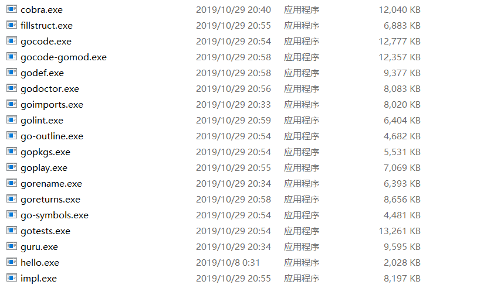
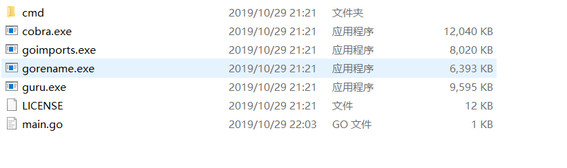
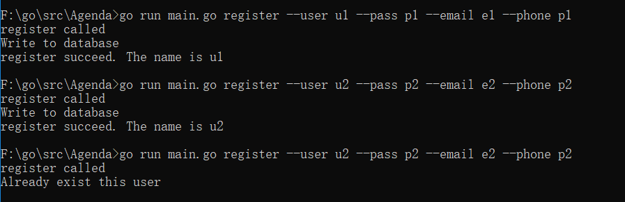
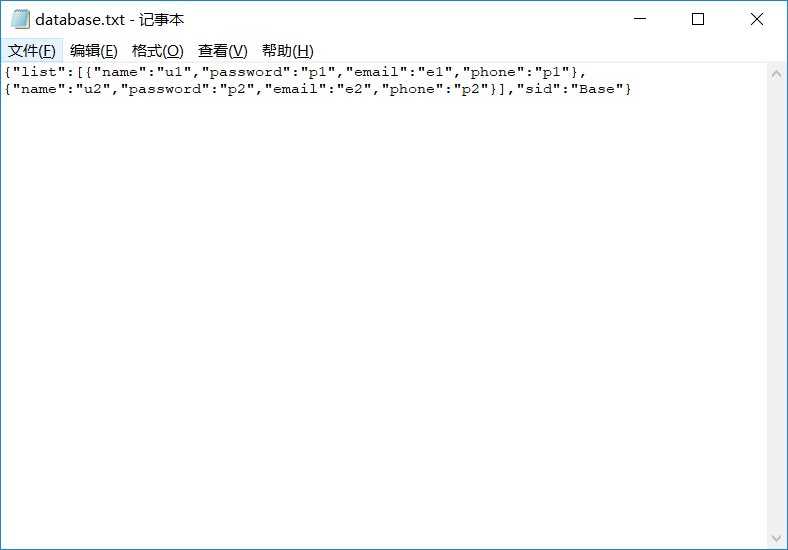
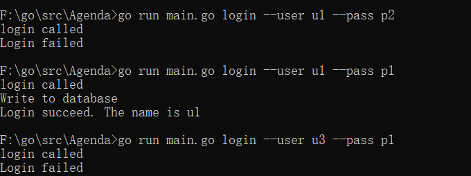

# Homework6k

### Cobra安装

 使用命令 `go get -v github.com/spf13/cobra/cobra` 下载，这个过程需要保证一定的网络通信。

此时一般会出现错误提示，新建一个目录于` $GOPATH/src/golang.org/x `,使用git clone安装sys和text项目，最后使用 `go install github.com/spf13/cobra/cobra `，，此时Bin目录下出现cobra程序




### 初始化

使用`cobra init `进行初始化

使用`cobra add register  `添加register指令

使用`cobra add login  `添加login指令

 

工作目录生成完毕


### 构建持久化Database

由于需要使用json进行数据持久化，首先考虑Database的搭建

首先创建一个user类和存储的列表

```go
type User struct {
	Name     string `json:"name"`
	Password string `json:"password"`
	Email    string `json:"email"`
	Phone    string `json:"phone"`
}

type Userlist struct {
	List []User `json:"list"`
	ID   string `json:"sid"`
}
```

封装添加用户函数`func adduser(s User) 
`

```go
	json.Unmarshal(bytes, &u)
	u.ID = "Base"
	u.List = append(u.List, User{s.Name, s.Password, s.Email, s.Phone})

	st, err := json.Marshal(u)
	ioutil.WriteFile("database.txt", st, 0664)
```

类似的搭建`func queryUser(s User) bool `和`func queryUserandPassword(s User) bool`,用于检测是否已经使用这个名字以及名字和密码是否匹配


### Register功能实现

首先配置flags, register应该需要有4个参数

```go
	registerCmd.Flags().StringP("user", "u", "Anonymous", "Username")
	registerCmd.Flags().StringP("pass", "p", "Anonymous", "Password")
	registerCmd.Flags().StringP("email", "e", "Anonymous", "Email")
	registerCmd.Flags().StringP("phone", "o", "Anonymous", "PhoneNumber")
```

解析参数之后，判断是否存在，如果不存在，则添加用户，否则提示错误。

```go
if !queryUser(User{username, password, email, phone}) {
	adduser(User{username, password, email, phone})
	fmt.Println("register succeed. The name is", username)
} else {
	fmt.Println("Already exist this user")
}
```


### Login功能实现

配置flags, Login应该需要有2个参数

```go
	loginCmd.Flags().StringP("user", "", "Anonymous", "Username")
	loginCmd.Flags().StringP("pass", "", "Anonymous", "Password")
```

解析参数之后，判断用户名和密码是否符合或者用户是否存在，否则提示错误。

```go
if queryUserandPassword(User{username, password, "", ""}) {
	adduser(User{username, password, "", ""})
	fmt.Println("Login succeed. The name is", username)
} else {
	fmt.Println("Login failed")
}
```


----

## 测试

测试环境为Win10x64




可以看出能够正确的注册且能够判断是否合法。

database中的数据：



可见数据被正确的持久化


Login测试，可见能够正确login，并且能够判断是否合法。




