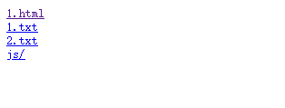
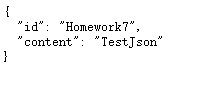
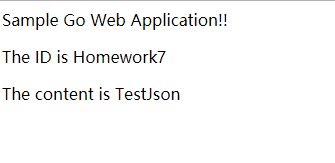
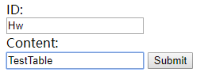
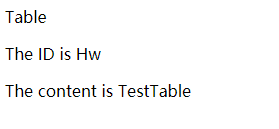
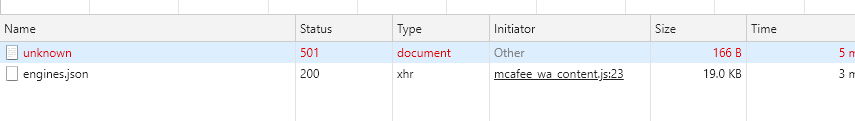

## 处理 web 程序的输入与输出

### 1、概述

设计一个 web 小应用，展示静态文件服务、js 请求支持、模板输出、表单处理、Filter 中间件设计等方面的能力。（不需要数据库支持）

### 2、任务

编程 web 应用程序 cloudgo-io。 

**基本要求**

1. 支持静态文件服务

添加对应的Routes配置
```go
mx.PathPrefix("/").Handler(http.FileServer(http.Dir(webRoot + "assets/")))
```

执行该代码，若Assets目录中，不设置对应的index.html文件，可以得到静态Http文件服务。



2. 支持简单 js 访问

加入测试Handler

```go
mx.HandleFunc("/api/test", apiTestHandler(formatter)).Methods("GET")
```


```go
func apiTestHandler(formatter *render.Render) http.HandlerFunc {

	return func(w http.ResponseWriter, req *http.Request) {
		formatter.JSON(w, http.StatusOK, struct {
			ID      string `json:"id"`
			Content string `json:"content"`
		}{ID: "Homework7", Content: "TestJson"})
	}
}
```

请求/api/test/,得到对应的返回结果



请求index.html，可以看出已经成功使用js进行访问




3. 提交表单，并输出一个表格

对Index.html添加表单

```html
<form method="POST"Hw>
       ID:<br>
       		<input type="text" name="ID">
       <br>
       Content:<br>
       		<input type="text" name="Content">
       		<input type="submit" value="Submit" />
</form>
```





构建对应的模板

```html
<html>
<head>
  <link rel="stylesheet" href="css/main.css"/>
</head>
<body>
    Table<br>
      <div>
          <p class="greeting-id">The ID is {{.ID}}</p>
          <p class="greeting-content">The content is {{.Content}}</p>
      </div>
</body>
</html>

```


通过js处理Post请求，得到对应的页面



4. 对 `/unknown` 给出开发中的提示，返回码 `5xx`

添加处理handler

```go
func e501(reqw http.ResponseWriter, req *http.Request) {
	http.Error(reqw, "501", 501)
}
```

检查网络返回信号



