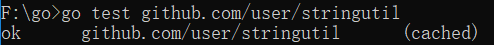

# 第五周作业

## 文件目录

HW5/
	hw5.go #作业代码
	测试截图.md
	测试截图.pdf  #两种格式的测试报告

# 第四周作业

## 文件目录
HW4/
	homework4.go   #最小堆作业代码

# 第三周作业

## pdf作业分享地址

分享链接： http://139.9.57.167:20080/share/blvjo9md0lit3phfpkk0?secret=false

另外本目录中t1.go即为本作业的地址

---

## 本地搭建作业

### 文件目录
bin/
	hello                 # 可执行命令
pkg/
	linux_amd64/
		code.google.com/p/go.example/
			stringutil.a     # 包对象
		github.com/user/
			stringutil.a     # 包对象
src/
	code.google.com/p/go.example/
		hello/
			hello.go      # 命令源码
		stringutil/
			reverse.go       # 包源码
			reverse_test.go  # 测试源码
	github.com/user/
		hello/
			hello.go      # 命令源码
		stringutil/
			reverse.go       # 包源码
			reverse_test.go  # 测试源码

### 测试结果：

